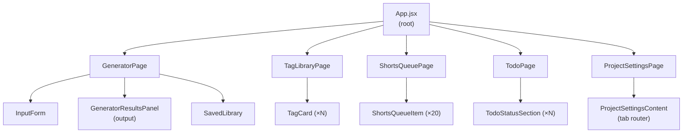
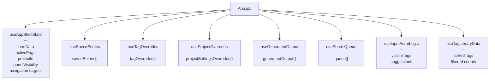
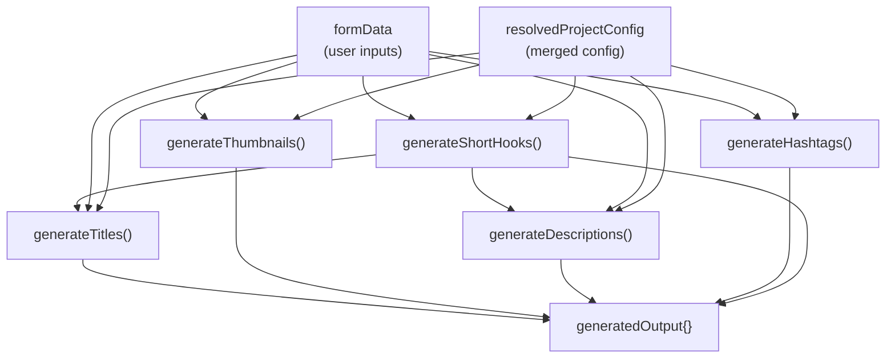
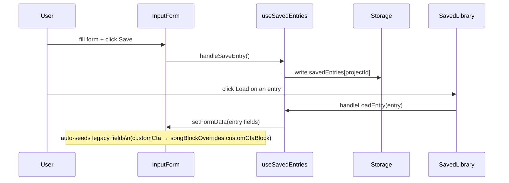
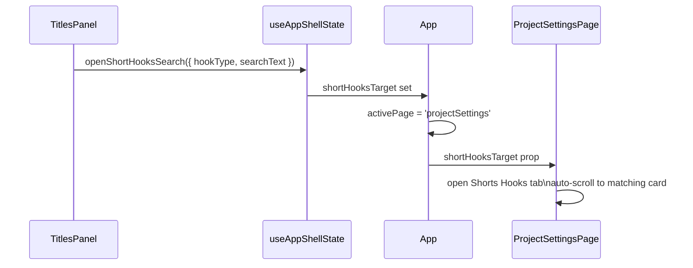
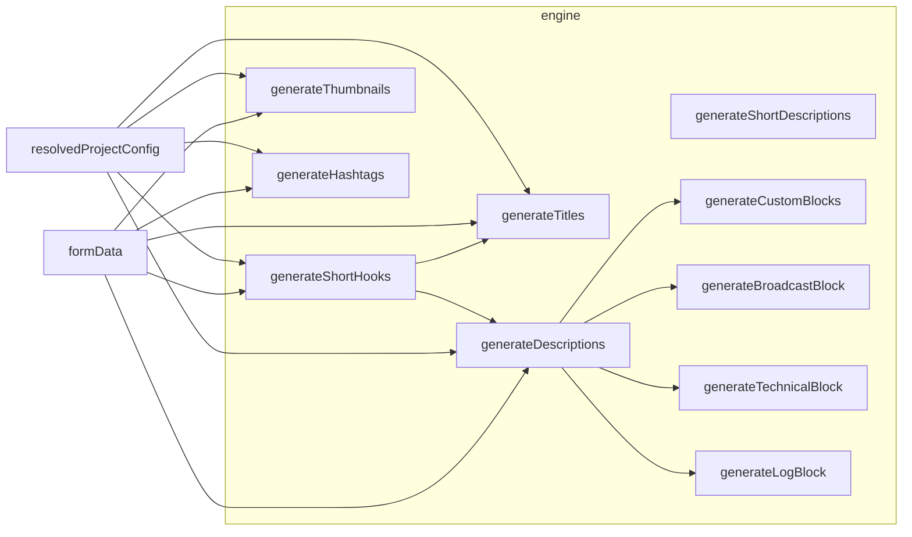
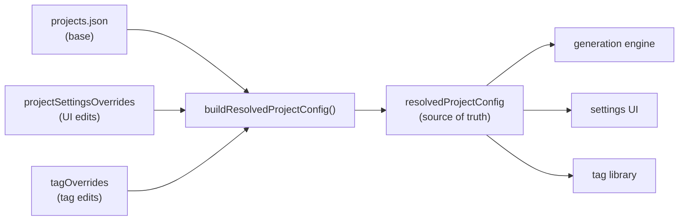
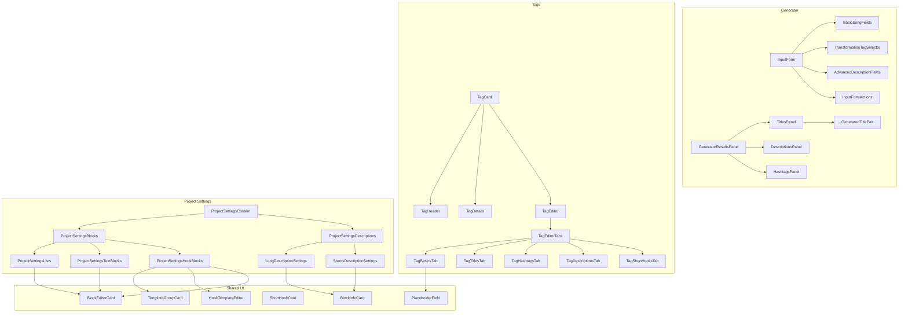
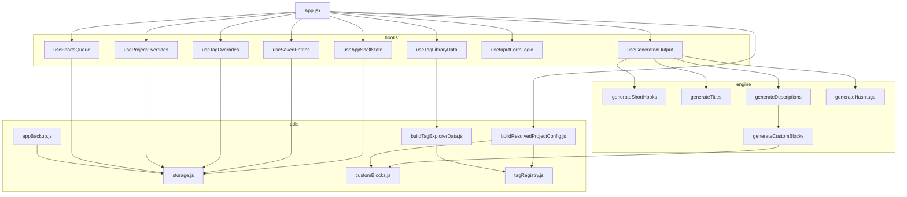
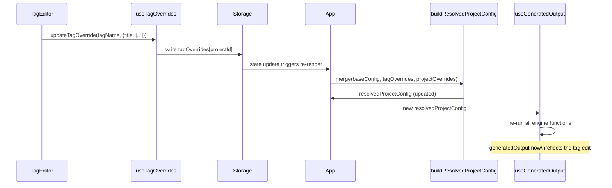

# Illegal Mind Generator — Architecture

This document describes how the application is built. It assumes you've already read [project-overview.md](project-overview.md).

---

## Table of Contents

1. [Tech Stack](#tech-stack)
2. [Folder Structure](#folder-structure)
3. [Main Pages](#main-pages)
4. [State Management](#state-management)
5. [Data Flow](#data-flow)
6. [Storage Architecture](#storage-architecture)
7. [Generation Engine](#generation-engine)
8. [Config Resolution](#config-resolution)
9. [Component Architecture](#component-architecture)
10. [Module Dependencies](#module-dependencies)
11. [Cross-System Interactions](#cross-system-interactions)

---

## Tech Stack

React 19 · JavaScript · Vite · localStorage

No external libraries. No routing library. No state management library. No CSS framework. The project is intentionally minimal — single developer, local-first, no backend.

---

## Folder Structure

```
src/
├── App.jsx                   # Root: routing, shared state, config resolution
├── main.jsx                  # Vite entry point
├── index.css                 # All styles (global)
│
├── pages/                    # Page-level orchestration only
│   ├── GeneratorPage.jsx
│   ├── TagLibraryPage.jsx
│   ├── ShortsQueuePage.jsx
│   ├── TodoPage.jsx
│   └── ProjectSettingsPage.jsx
│
├── components/               # Feature UI components
│   ├── AppMenu.jsx           # Top nav + project selector
│   ├── AppBackupControls.jsx # Backup/restore buttons
│   ├── InputForm.jsx         # Generator input orchestrator
│   │
│   ├── input/                # Input sub-components
│   │   ├── BasicSongFields.jsx
│   │   ├── TransformationTagSelector.jsx
│   │   ├── AdvancedDescriptionFields.jsx
│   │   ├── InputFormActions.jsx
│   │   └── QueueSettings.jsx
│   │
│   ├── output/               # Generator output panels
│   │   ├── GeneratorResultsPanel.jsx
│   │   ├── TitlesPanel.jsx
│   │   ├── GeneratedTitlePair.jsx
│   │   ├── ShortHookTitles.jsx
│   │   ├── DescriptionsPanel.jsx
│   │   ├── HashtagsPanel.jsx
│   │   ├── YouTubeTagsPanel.jsx
│   │   └── ShortHooksPanel.jsx
│   │
│   ├── savedLibrary/
│   │   ├── SavedLibrary.jsx
│   │   └── SavedLibraryItem.jsx
│   │
│   ├── shortsQueue/
│   │   ├── ShortsQueueItem.jsx
│   │   └── ShortsQueueEmptyState.jsx
│   │
│   ├── todo/
│   │   ├── TodoStatusSection.jsx
│   │   ├── TodoItem.jsx
│   │   ├── TodoStatusSelect.jsx
│   │   ├── TodoFields.jsx
│   │   └── TodoBulkAdd.jsx
│   │
│   ├── tags/
│   │   ├── TagCard.jsx
│   │   ├── TagHeader.jsx
│   │   ├── TagDetails.jsx
│   │   ├── TagEditor.jsx
│   │   ├── TagControls.jsx
│   │   ├── TagFilters.jsx
│   │   ├── TagPhraseEditor.jsx
│   │   ├── TagPhraseList.jsx
│   │   ├── TagUsedSongList.jsx
│   │   ├── TagStatusChip.jsx
│   │   └── editor/
│   │       ├── TagEditorTabs.jsx
│   │       ├── TagBasicsTab.jsx
│   │       ├── TagTitlesTab.jsx
│   │       ├── TagHashtagsTab.jsx
│   │       ├── TagDescriptionsTab.jsx
│   │       └── TagShortHooksTab.jsx
│   │
│   ├── projectSettings/
│   │   ├── ProjectSettingsContent.jsx
│   │   ├── ProjectSettingsGeneral.jsx
│   │   ├── ProjectSettingsShortHooks.jsx
│   │   ├── ProjectSettingsTitles.jsx
│   │   ├── ProjectSettingsDescriptions.jsx
│   │   ├── ProjectSettingsLinks.jsx
│   │   ├── ProjectSettingsBlocks.jsx
│   │   ├── ProjectSettingsLists.jsx
│   │   ├── ProjectSettingsTextBlocks.jsx
│   │   ├── ProjectSettingsHookBlocks.jsx
│   │   ├── blocks/
│   │   │   ├── BlockEditorCard.jsx
│   │   │   ├── BlockActions.jsx
│   │   │   ├── TextBlockEditor.jsx
│   │   │   ├── StructuredListEditor.jsx
│   │   │   ├── AddBlockForm.jsx
│   │   │   ├── AddTextBlockForm.jsx
│   │   │   ├── AddListBlockForm.jsx
│   │   │   ├── ListItemRow.jsx
│   │   │   └── LinksRegistryEditor.jsx
│   │   ├── descriptions/
│   │   │   ├── LongDescriptionSettings.jsx
│   │   │   └── ShortsDescriptionSettings.jsx
│   │   └── titles/
│   │       ├── TitleGenerationCard.jsx
│   │       ├── TitlePrefixSuffixSection.jsx
│   │       └── TitleTransformationSection.jsx
│   │
│   └── ui/                   # Reusable UI primitives
│       ├── IconButton.jsx
│       ├── TemplateGroupCard.jsx
│       ├── ShortHookCard.jsx
│       ├── HookTemplateEditor.jsx
│       ├── PlaceholderField.jsx
│       ├── PhraseRow.jsx
│       ├── BulkTextarea.jsx
│       ├── NavLinkButton.jsx
│       ├── MoveControls.jsx
│       ├── BlockInfoCard.jsx
│       ├── FormSelect.jsx
│       ├── LabelInputRow.jsx
│       ├── LabelSliderRow.jsx
│       ├── AddBulkRow.jsx
│       ├── ToggleInputRow.jsx
│       ├── SubTabNav.jsx
│       └── ToggleField.jsx
│
├── hooks/                    # Custom React hooks (all state ownership)
│   ├── useAppShellState.js
│   ├── useGeneratedOutput.js
│   ├── useInputFormLogic.js
│   ├── useProjectOverrides.js
│   ├── useSavedEntries.js
│   ├── useShortsQueue.js
│   ├── useTagOverrides.js
│   └── useTagLibraryData.js
│
├── engine/                   # Pure generation logic (no React, no side effects)
│   ├── titles/
│   │   ├── generateTitles.js
│   │   └── generateThumbnails.js
│   ├── descriptions/
│   │   ├── generateDescriptions.js
│   │   ├── generateShortDescriptions.js
│   │   ├── generateCustomBlocks.js
│   │   ├── generateBroadcastBlock.js
│   │   ├── generateTechnicalBlock.js
│   │   ├── generateLogBlock.js
│   │   └── descriptionTagHelpers.js
│   ├── hooks/
│   │   └── generateShortHooks.js
│   └── hashtags/
│       └── generateHashtags.js
│
├── utils/                    # Storage helpers and config builders
│   ├── storage.js
│   ├── appBackup.js
│   ├── buildResolvedProjectConfig.js
│   ├── customBlocks.js
│   ├── tagRegistry.js
│   ├── buildTagExplorerData.js
│   └── hookPlaceholders.js
│
├── config/
│   ├── projects.json         # Base config for both projects
│   └── projectSettingsSections.js
│
└── constants/
    └── defaultFormData.js
```

### Architectural rules

- **Pages orchestrate.** Pages call hooks, assemble props, and render feature components. No logic in pages that belongs in a hook or engine.
- **Feature logic in components.** A component that manages its own sub-state (e.g. collapse, local edit buffer) keeps it locally.
- **Generation in `engine/`.** No engine calls from components. Engine functions are pure: in → out, no side effects.
- **Storage in `utils/`.** All localStorage reads and writes go through `storage.js`.

---

## Main Pages



Navigation is a single `activePage` string toggled by `AppMenu`. There is no router library — `App.jsx` conditionally renders the active page.

### GeneratorPage

The main workflow. Left panel: `InputForm`. Right panel: `GeneratorResultsPanel`. `SavedLibrary` sits above both as a collapsible drawer.

Callbacks it owns: `handleLoadEntry`, `handleSaveEntry`, `handleClearForm`, `handleRegenerate`. All feed into `formData`, which triggers re-generation automatically via `useGeneratedOutput`.

### TagLibraryPage

Renders a `TagCard` for every tag in the resolved project config. Uses `useTagLibraryData` for client-side filtering, sorting, and usage counts. Writes tag overrides via `useTagOverrides`. Provides a sync feature that copies all overrides from one project to the other.

### ShortsQueuePage

Renders the 20-item Shorts upload queue. State owned by `useShortsQueue`. Randomize and mark-as-uploaded are the only mutations.

### TodoPage

Renders saved entries grouped by `todo.status`. Reads from `savedEntries`. Mutations go through `useSavedEntries.handleUpdateEntryTodo`.

### ProjectSettingsPage

A tab-based config editor. Active section stored in `ui.projectSettingsSection` (persisted). Navigation targets (e.g. "jump to hook type X") arrive as props and cause the relevant tab to open and scroll to the correct card.

---

## State Management

All state lives in custom hooks. There is no global store, no context, no Redux. `App.jsx` calls all hooks and passes data down as props.



### Hook responsibilities

| Hook | Owns | Reads from storage | Writes to storage |
|------|------|--------------------|-------------------|
| `useAppShellState` | `formData`, `activePage`, `projectId`, `panelVisibility`, nav targets | `generator.formData`, `ui.*` | `generator.formData`, `ui.*` |
| `useSavedEntries` | `savedEntries[]` per project | `savedEntries[projectId]` | `savedEntries[projectId]` |
| `useTagOverrides` | `tagOverrides{}` per project | `tagOverrides[projectId]` | `tagOverrides[projectId]` |
| `useProjectOverrides` | `projectSettingsOverrides{}` per project | `projectOverrides[projectId]` | `projectOverrides[projectId]` |
| `useGeneratedOutput` | `generatedOutput{}` (derived, not persisted) | — | — |
| `useShortsQueue` | `queue[]` per project | `shortsQueues[projectId]` | `shortsQueues[projectId]` |
| `useInputFormLogic` | Nothing (derived from props) | — | — |
| `useTagLibraryData` | Nothing (derived from props) | — | — |

`useGeneratedOutput`, `useInputFormLogic`, and `useTagLibraryData` are pure computation hooks — they derive output from their inputs and write nothing to storage.

### formData shape

The generator form is the central piece of input state:

```js
{
  artist: string,
  song: string,
  signalNumber: string,
  videoType: 'long' | 'shorts',
  transformationTags: [string],
  customHashtags: string,
  excludeFromRandomizer: boolean,
  todo: { status: string, notes: string },
  songBlockOverrides: {
    [blockKey]: string | { items: [{label, text|link}] }
  }
}
```

Any change to `formData` triggers `useGeneratedOutput` to re-run synchronously.

---

## Data Flow

### Generator output pipeline



`generateShortHooks` runs first because its output feeds into `generateTitles` and `generateDescriptions`.

All engine functions are called inside a `useMemo` in `useGeneratedOutput`. Re-generation (from the Regenerate button) increments a `seed` value included in the memo dependency array, forcing a re-run without any input changes.

### Entry save / load cycle



### Cross-page navigation (output → settings)

Some output items (generated titles, hooks) display a source link that lets the user jump to the config editor that controls it. The flow uses "navigation targets" in `useAppShellState`:



Similar patterns exist for `openTagLibrarySearch`, `openTitlesSearch`, and `openBlocksEditor`.

---

## Storage Architecture

### Single key

All app state is stored under one localStorage key: `illegalMindGeneratorData`.

```js
{
  version: number,

  savedEntries: {
    [projectId]: [entry]
  },

  tagOverrides: {
    [projectId]: {
      [tagName]: { /* partial tag override */ }
    }
  },

  tagVisibilityOverrides: { /* legacy — must stay for data-shape compatibility */ },

  shortsQueues: {
    [projectId]: { queue: [entry] }
  },

  projectOverrides: {
    [projectId]: { /* project settings overrides */ }
  },

  ui: {
    selectedProject: string,
    activePage: string,
    showSavedLibrary: boolean,
    hideQueueHidden: boolean,
    panelVisibility: { [panelKey]: boolean },
    projectSettingsSection: string
  },

  generator: {
    formData: { /* current form state */ }
  }
}
```

### Storage API (`utils/storage.js`)

```js
loadAppStorage()                    // reads + parses + applies defaults
saveAppStorage(nextStorage)         // writes full object
updateAppStorage(updater)           // updater(current) → next; reads, applies, writes
```

All hooks use `updateAppStorage` for mutations to avoid stale-read races.

### Legacy key fallbacks

Each hook does a one-time fallback read of the old standalone key on first mount. If the unified field is empty and the legacy key has data, the hook seeds the unified field from the legacy key and never reads the legacy key again. This is the migration strategy — per-hook, on first load only.

The old standalone keys (`savedEntries`, `shortsQueueByProject`, `tagOverrides`, etc.) are now inert. No new code should read or write them.

### Backup

`appBackup.js` exports the full unified storage object as a downloadable JSON file. Import restores the full object back to localStorage. The backup is the safety net for all storage refactoring — test it after any structural change.

---

## Generation Engine

All engine functions live in `src/engine/`. They are pure functions: no React, no side effects, no storage reads.



### Title object shape

Generated titles are objects, not plain strings:

```js
{
  text: string,
  sourceHook: {
    sourceType: 'tag' | 'base',
    sourceTag: string | null,
    hookType: string,
    sourceText: string
  } | null,
  sourceTemplate: {
    template: string,
    groupName: string
  } | null
}
```

Both `sourceHook` and `sourceTemplate` are null for plain-text titles. This shape powers the source navigation links in the output UI — `NavLinkButton` in `GeneratedTitlePair` handles all four combinations.

### Description block rendering

Descriptions are assembled from blocks. `generateCustomBlocks.js` provides the shared rendering layer:

```js
renderStructuredBlock(block, overrides, tagLine) → string
  // Joins all items ('all' displayMode) or picks one at random ('random')

renderCustomBlock(block, projectConfig, formData, tagLine, songOverride) → string
  // Dispatches to list, text, or hook block rendering
  // Applies song-level override when set

resolveHookBlockTemplates(layoutKey, projectConfig) → [string]
  // Returns the template array for any hook block by its layout key
  // Works for both static (projects.json) and user-created (customHookBlocks) blocks

getEffectiveSongOverrides(formData) → object
  // Merges legacy fields (customCta, customStory, customLogNote) into songBlockOverrides
  // songBlockOverrides wins when both are set
```

---

## Config Resolution

`buildResolvedProjectConfig` is called in `App.jsx` on every render where overrides change. It merges three sources into the single config object all engine functions use:



What gets merged:

- Title templates, prefix/suffix, "but it's" rules
- Short hook type templates
- Thumbnail word pools and patterns
- Description block templates and layout arrays
- Per-tag overrides (each tag's title phrases, hashtags, hook phrases, description lines)
- User-created custom hook blocks (appended to `hookBlocks` array)
- Link registry
- Hashtags and YouTube tags

The resolved config is the only thing the engine ever sees. Nothing reads directly from `projects.json` at runtime.

### projects.json schema (top level)

```js
{
  [projectId]: {
    name: string,
    todoStatuses: [string],
    title: {
      longPrefix: string,     // Illegal Mind uses longPrefix (legacy key — do not rename)
      prefix: string,         // Maxx Dee uses prefix
      shortsSuffix: string,
      shortHookSuffix: string,
      templates: { standard: [], butIts: [] },
      butItsExcludedTags: [],
      connector: string,
      maxTransformationPhrases: number
    },
    shortHookTypes: {
      [hookType]: { label, templates: [] }
    },
    tags: {
      [tagName]: {
        label, category, visible,
        title: [],
        thumbnail: [],
        hashtags: [],
        description: { technical: [], log: [], status: [] },
        shortHooks: { [hookType]: [] },
        excludeFromHashtags: boolean,
        excludeFromButIts: boolean
      }
    },
    thumbnail: { words: [], fallbacks: [], patterns: [] },
    hashtags: [],
    youtubetags: [],
    description: {
      copyFooter: string,
      links: { [key]: url },
      templates: {
        long: {
          layout: [string],
          customBlocks: { [key]: block },
          hookBlocks: [{ key, label, path, templateKey, descriptionLayoutKey?, ... }],
          phraseBlockScopes: { [key]: 'song'|'project' },
          hookBlockTargets: { [key]: 'long'|'shorts'|'both' },
          customHookBlocks: [{ key, label }],
          [phraseArrayKey]: [string]
        },
        shorts: { layout: [string], ... }
      }
    }
  }
}
```

---

## Component Architecture

### UI primitives layer (`components/ui/`)

These are the building blocks used everywhere else. They know nothing about the domain.

| Component | Purpose |
|-----------|---------|
| `PlaceholderField` | Input or textarea with `{placeholder}` autocomplete. Two save modes: `onBlur` (phrase editors) or `onChange` (live, for controlled inputs). |
| `PhraseRow` | Single editable phrase with delete button. Uses `PlaceholderField`. Forwarded ref for scroll-to-highlight. |
| `HookTemplateEditor` | Scrollable list of `PhraseRow` components with search, +Add, and +Bulk controls. `noWrapper` skips the `<details>` collapse. |
| `TemplateGroupCard` | Collapsible card with a label, template list, reset button, count badge, and optional slider. Base component for all hook block and hook type cards. |
| `ShortHookCard` | Thin adapter over `TemplateGroupCard` for the hook-specific data shape. |
| `BlockInfoCard` | Non-editable card for description layout views. Shows a nav arrow when `onNavigate` is set. |
| `SubTabNav` | Underline-style tab nav. Used in description layouts and tag editors. |
| `IconButton` | All small action buttons (reset ↺, remove ×, lock 🔒, up/down). |
| `MoveControls` | Up/down reorder pair built on `IconButton`. |
| `NavLinkButton` | Clickable text that fires a navigation callback. `muted` prop for base-hook sources. |
| `FormSelect` | Standard dropdown with `stopPropagation` (safe inside clickable card headers). |
| `ToggleInputRow` | Checkbox + label + `PlaceholderField` in live (`onChange`) mode. |
| `LabelSliderRow` | Label + range slider + value display. Passes `--val` CSS custom property for amber fill styling. |

### Feature component layers



### Block editor shared shell

`BlockEditorCard` is the shared wrapper for all three block type editors (List, Text, Hook). It provides: collapse, Scope dropdown, Target dropdown, and `BlockActions` (reset/lock/delete). The inner editor (`StructuredListEditor`, `TextBlockEditor`, `HookTemplateEditor`) is passed as children.

---

## Module Dependencies



**Nothing reads `projects.json` at runtime except `App.jsx`.** Pages, hooks, and the engine all receive `resolvedProjectConfig` as a prop or argument. This is the critical seam — changing the config shape means updating `buildResolvedProjectConfig` and the config consumers, but not touching the engine internals.

**The engine never imports from hooks or components.** Engine functions take plain objects and return plain objects. This makes them trivially testable and prevents circular dependencies.

**`customBlocks.js` is shared between engine and UI.** Both `buildResolvedProjectConfig` (config layer) and `generateCustomBlocks` (engine layer) import block utilities from `customBlocks.js`. This is intentional — the block type definitions must agree between config resolution and rendering.

---

## Cross-System Interactions

### Tag edits → generation output



### Project settings → description layout

When the user reorders blocks in Project Settings → Descriptions, the change writes to `projectOverrides`. `buildResolvedProjectConfig` merges this into `resolvedProjectConfig.description.templates.long.layout`. `generateDescriptions` reads the layout array and renders blocks in that order.

### Saved entry → shorts queue

The shorts queue draws from `savedEntries`. When an entry is created, edited, or deleted, the queue is not automatically updated — the user clicks Randomize to rebuild it from the current entry set. `markUploaded` refills one slot from the current `savedEntries` state at the moment of the call.

### Todo status → saved entry

Todo status and notes are stored as `entry.todo` inside the saved entry object. The `TodoPage` reads entries from `useSavedEntries`, groups them by `todo.status`, and writes back via `handleUpdateEntryTodo`. There is no separate todo data structure.

### Legacy field migration on entry load

When loading an old saved entry (pre-block-system), `useSavedEntries.handleLoadEntry` seeds `songBlockOverrides` from legacy fields:

- `entry.customCta` → `songBlockOverrides.customCtaBlock`
- `entry.customStory` → `songBlockOverrides.storyBlock`
- `entry.customLogNote` → `songBlockOverrides.logBlock`

This happens at load time only. The entry is not mutated in storage until the user saves it again, at which point the new fields are written and the legacy fields are preserved-but-shadowed.

---

## Notable Constraints

**No global event bus.** Cross-component communication goes through props and callbacks lifted to `App.jsx`. Navigation targets are one exception — they're stored in `useAppShellState` and passed as props to the destination page.

**Synchronous generation.** All generation runs synchronously inside a `useMemo`. There is no debouncing or background computation. This is fast enough because the engine functions are cheap; revisit only if templates grow very large.

**Styles are global.** All CSS lives in `index.css`. There are no CSS modules, styled-components, or Tailwind classes. Class names are domain-specific (`.tag-card`, `.desc-block`, `.form-input`). Refactoring CSS is a known TODO.

**No test suite.** There are no unit or integration tests. The backup/import cycle and manual browser testing are the current verification methods.
