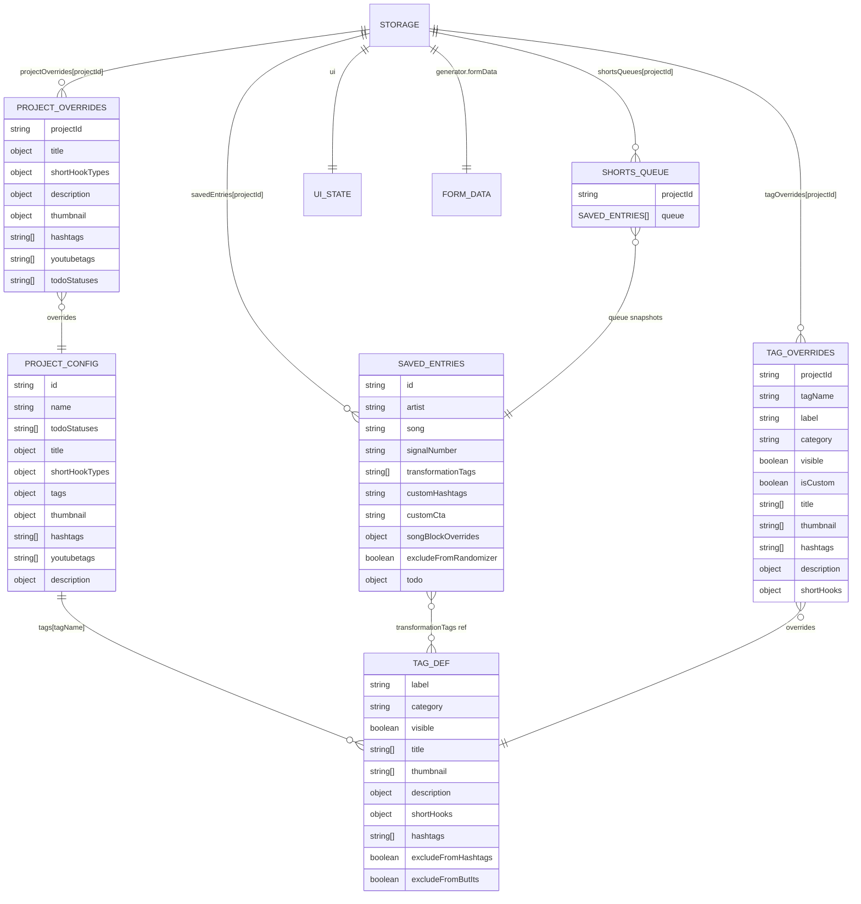

# Illegal Mind Generator — Data Model

This is the single source of truth for all application data structures. All field names, types, and shapes are sourced directly from the code.

---

## Table of Contents

1. [Storage Overview](#storage-overview)
2. [Root Storage Object](#root-storage-object)
3. [Saved Entries](#saved-entries)
4. [Tag Registry](#tag-registry)
5. [Tag Overrides](#tag-overrides)
6. [Shorts Queue](#shorts-queue)
7. [Project Settings Overrides](#project-settings-overrides)
8. [Generator Form State](#generator-form-state)
9. [UI State](#ui-state)
10. [Project Configuration (projects.json)](#project-configuration-projectsjson)
11. [Block Types](#block-types)
12. [Backup File Format](#backup-file-format)
13. [Legacy Keys](#legacy-keys)
14. [Entity Relationships](#entity-relationships)

---

## Storage Overview

All live application state is stored in a single localStorage key:

```
Key: illegalMindGeneratorData
```

There is no database, no backend, and no cloud sync. The entire app state is a single JSON object. Reading and writing go through `src/utils/storage.js`.

```js
// src/utils/storage.js
loadAppStorage()           // read + parse + apply defaults
saveAppStorage(obj)        // write full object
updateAppStorage(fn)       // fn(current) → next; atomic read-modify-write
```

---

## Root Storage Object

**Purpose:** Top-level container for all persisted application state.

**Source:** `src/utils/storage.js` — `defaultStorage`

### Fields

| Field | Type | Default | Description |
|-------|------|---------|-------------|
| `version` | `number` | `1` | Schema version identifier |
| `savedEntries` | `object` | `{}` | Map of `projectId → entry[]` |
| `tagOverrides` | `object` | `{}` | Map of `projectId → { tagName → override }` |
| `tagVisibilityOverrides` | `object` | `{}` | Legacy compatibility field — do not remove |
| `shortsQueues` | `object` | `{}` | Map of `projectId → { queue: entry[] }` |
| `projectOverrides` | `object` | `{}` | Map of `projectId → settings overrides` |
| `ui` | `object` | see [UI State](#ui-state) | Navigation and panel state |
| `generator` | `object` | `{ formData: {} }` | Current generator form state |

### Example

```json
{
  "version": 1,
  "savedEntries": {
    "illegalMindCovers": [ ... ],
    "maxxDeeCovers": [ ... ]
  },
  "tagOverrides": {
    "illegalMindCovers": { ... },
    "maxxDeeCovers": { ... }
  },
  "tagVisibilityOverrides": {},
  "shortsQueues": {
    "illegalMindCovers": { "queue": [ ... ] }
  },
  "projectOverrides": {
    "illegalMindCovers": { ... }
  },
  "ui": {
    "selectedProject": "illegalMindCovers",
    "activePage": "generator",
    "showSavedLibrary": false,
    "hideQueueHidden": false,
    "advancedOptionsOpen": false,
    "panelVisibility": {
      "titles": true,
      "descriptions": true,
      "hashtags": true,
      "hybridPrompt": true,
      "advanced": false
    }
  },
  "generator": {
    "formData": { ... }
  }
}
```

---

## Saved Entries

**Purpose:** The song library. Each entry represents one saved cover with its metadata, transformation choices, and production status.

**Storage path:** `savedEntries[projectId][]`

**Hook:** `src/hooks/useSavedEntries.js`

### Entry ID

Generated by `buildEntryId(artist, song)`:

```js
`${artist}-${song}`.trim().toLowerCase().replace(/\s+/g, ' ')
```

IDs are used for deduplication. Saving an entry with the same artist+song as an existing entry replaces it. The ID is not shown in the UI.

### Fields

| Field | Type | Required | Description |
|-------|------|----------|-------------|
| `id` | `string` | yes | `"artist-song"` normalized (auto-generated) |
| `artist` | `string` | yes | Artist name, trimmed |
| `song` | `string` | yes | Song name, trimmed |
| `signalNumber` | `string` | no | Illegal Mind only — signal number (e.g. `"042"`) |
| `transformationTags` | `string[]` | yes | Tag keys selected (e.g. `["heavier", "darker"]`) |
| `customHashtags` | `string` | no | Extra hashtags, space-separated. Trimmed on save. |
| `customCta` | `string` | no | **Legacy.** Song-level call-to-action text. Migrates to `songBlockOverrides.customCtaBlock` on load. |
| `songBlockOverrides` | `object` | no | Per-block song-level content overrides. See [Song Block Overrides](#song-block-overrides). |
| `excludeFromRandomizer` | `boolean` | no | When `true`, entry is excluded from Shorts queue generation |
| `todo` | `object` | yes | Production status. See [Todo](#todo). |

### Song Block Overrides

**Storage path:** `entry.songBlockOverrides`

Each key is a block key (camelCase, e.g. `gearBlock`, `storyBlock`, `customCtaBlock`). The value shape depends on block type:

| Block type | Override shape | Example |
|------------|----------------|---------|
| Text block | `string` (plain text) | `"Check the gear list below."` |
| List block | `{ items: [{ label, text\|link }] }` | `{ items: [{ label: "• Guitar", text: "Les Paul" }] }` |
| Hook block | `string` (plain text, wins over random pick) | `"This one was a tough one to nail."` |

A `null` or missing key means "use project default". The `↺` button in the generator removes a key entirely.

**Legacy fields seeded on load** (`src/hooks/useSavedEntries.js` — `handleLoadEntry`):

| Legacy field | Seeds into | Condition |
|---|---|---|
| `entry.customCta` | `songBlockOverrides.customCtaBlock` | only if `customCtaBlock` not already set |
| `entry.customStory` | `songBlockOverrides.storyBlock` | only if `storyBlock` not already set |
| `entry.customLogNote` | `songBlockOverrides.logBlock` | only if `logBlock` not already set |

These fields are still written to the entry object on import for backward compatibility.

### Todo

**Storage path:** `entry.todo`

| Field | Type | Description |
|-------|------|-------------|
| `status` | `string` | One of the project's `todoStatuses` values, or empty string for no status |
| `notes` | `string` | Free-text production note. Trimmed on save. |

Default todo statuses (configurable per project in `projectConfig.todoStatuses`):
- `"Wishlist"`
- `"Needs Re-record"`
- `"Needs Remaster"`
- `"Needs Video"`

An empty `status` means the entry has no todo assignment and does not appear in the Todo page.

### Example — full entry

```json
{
  "id": "blink-182-all the small things",
  "artist": "Blink-182",
  "song": "All The Small Things",
  "signalNumber": "042",
  "transformationTags": ["heavier", "punk"],
  "customHashtags": "#Blink182 #PunkCovers",
  "customCta": "",
  "songBlockOverrides": {
    "storyBlock": "This one's been in the vault for years. Finally rebuilt it heavier.",
    "gearBlock": {
      "items": [
        { "label": "• Guitar", "text": "Schecter Omen-6" },
        { "label": "• Bass", "text": "Cort Action Bass" }
      ]
    }
  },
  "excludeFromRandomizer": false,
  "todo": {
    "status": "Needs Video",
    "notes": "Mix is done, waiting on footage edit."
  }
}
```

### Relationships

- `transformationTags[]` values reference keys in `projectConfig.tags` (e.g. `"heavier"`, `"punk"`)
- `songBlockOverrides` keys reference block keys defined in `projectConfig.description.templates.long.customBlocks` or `description.customHookBlocks`
- `todo.status` must be a value from `projectConfig.todoStatuses`
- Entries are scoped to one project via `savedEntries[projectId]`
- Queue entries are snapshots of saved entries (see [Shorts Queue](#shorts-queue))

---

## Tag Registry

**Purpose:** Defines transformation tags and the content they contribute to generation. The tag registry is the combination of base tag config (from `projects.json`) plus user overrides (from `tagOverrides`).

**Base config path:** `src/config/projects.json` → `[projectId].tags`

**Override path:** `tagOverrides[projectId][tagName]`

**Resolved config:** `buildResolvedProjectConfig()` merges both into `resolvedProjectConfig.tags`

### Tag Fields

| Field | Type | Required | Description |
|-------|------|----------|-------------|
| `label` | `string` | yes | Display name (e.g. `"Heavier"`) |
| `category` | `string` | yes | One of the category values below |
| `visible` | `boolean` | no | When `false`, hidden from tag selector. Defaults to `true`. |
| `isCustom` | `boolean` | no | `true` for tags created from the UI (not in base JSON) |
| `title` | `string[]` | yes | Phrases used in generated titles |
| `thumbnail` | `string[]` | yes | Words suggested for thumbnail text |
| `description` | `object` | yes | Description line arrays — see below |
| `description.technical` | `string[]` | yes | Technical production notes for descriptions |
| `description.log` | `string[]` | yes | Log/operator notes for descriptions |
| `description.status` | `string[]` | yes | Status line text for descriptions |
| `shortHooks` | `object` | no | Per-hook-type phrase arrays — see below |
| `hashtags` | `string[]` | no | Hashtags contributed by this tag (without `#`). Falls back to tag key if empty. |
| `excludeFromHashtags` | `boolean` | no | When `true`, tag never contributes hashtags |
| `excludeFromButIts` | `boolean` | no | When `true`, tag is excluded from "but it's" title variants |

### Tag Categories

| Category | Description |
|----------|-------------|
| `"tempo"` | Speed-based (slower, faster) |
| `"energy"` | Intensity-based (heavier) |
| `"mood"` | Atmosphere-based (darker, nostalgia) |
| `"genre"` | Genre transformation (punk, hardcore, metal, nu metal, etc.) |
| `"language"` | Language cover (hebrew, russian) |
| `"era"` | Era-based (90s, 00s) |
| `"intent"` | Creative intent (faithful, modernized) |
| `"song part"` | Song-section focus (chorus) |
| `"production"` | Production style (modernized) |
| `"custom"` | User-created, uncategorized |

### shortHooks Fields

`shortHooks` is an object keyed by hook type. Each value is a `string[]` of phrase templates. Placeholders use `{artist}`, `{song}`, `{year}`, `{releaseyear}`, `{decade}`, etc.

Standard hook types (defined in `projectConfig.shortHookTypes`):

| Key | Display label |
|-----|---------------|
| `nostalgia` | Nostalgia |
| `emotion` | Emotion |
| `transformation` | Transformation |
| `discussion` | Discussion |
| `musician` | Musician |
| `progress` | Progress |

Additional types may exist in Maxx Dee (e.g. `"appreciation"`).

### Tag — Example (Illegal Mind, "heavier")

```json
{
  "label": "Heavier",
  "category": "energy",
  "title": ["Heavier", "Heavy", "Hitting Harder"],
  "thumbnail": [
    "HITS HARDER",
    "MORE WEIGHT",
    "EXTRA HEAVY",
    "CRUSHES HARDER"
  ],
  "description": {
    "technical": ["Weight: increased.", "Impact: reinforced."],
    "log": ["Modification: Additional weight was injected into the signal core."],
    "status": ["Signal weight: Increased.", "Load: Elevated."]
  }
}
```

### Tag — Example (Maxx Dee, "heavier" — with shortHooks)

```json
{
  "label": "Heavier",
  "category": "energy",
  "visible": false,
  "title": ["Heavier", "Heavy", "Hitting Harder"],
  "thumbnail": ["HITS HARDER", "MORE WEIGHT", "EXTRA HEAVY", "CRUSHES HARDER"],
  "description": {
    "technical": ["Weight: increased.", "Impact: reinforced."],
    "log": ["Modification: Additional weight was injected into the signal core."],
    "status": ["Signal weight: Increased.", "Load: Elevated."]
  },
  "shortHooks": {
    "emotion": [
      "{song} was never meant to hit this hard",
      "Didn't expect {song} to sound this heavy"
    ],
    "transformation": [
      "What if {song} had more weight?",
      "{song}, rebuilt with heavier bones"
    ],
    "discussion": [
      "Does {song} work better heavier?",
      "Original or heavier version of {song}?"
    ],
    "musician": [
      "More gain changed everything // {song}",
      "Same song. Bigger punch. // {song}"
    ],
    "progress": [
      "I covered {song} before — this one hits harder",
      "Years later, I pushed {song} further"
    ]
  }
}
```

### Tag — Example (with flags, "chorus")

```json
{
  "label": "Chorus",
  "category": "song part",
  "title": [],
  "thumbnail": [],
  "description": {
    "technical": [],
    "log": [],
    "status": []
  },
  "excludeFromHashtags": true,
  "excludeFromButIts": true,
  "shortHooks": {
    "nostalgia": [
      "This chorus still hits in {year}",
      "You hear this chorus and suddenly it's {releaseyear} again"
    ],
    "emotion": [
      "This chorus still hits",
      "Some choruses never lose power"
    ]
  }
}
```

---

## Tag Overrides

**Purpose:** User edits to tag data, stored separately from `projects.json` so the base config stays clean and resets are always possible.

**Storage path:** `tagOverrides[projectId][tagName]`

**Hook:** `src/hooks/useTagOverrides.js`

### Structure

```js
tagOverrides: {
  [projectId]: {
    [tagName]: {
      // Any subset of tag fields (partial override)
      label?: string,
      category?: string,
      visible?: boolean,
      isCustom?: boolean,     // true for tags created from UI
      title?: string[],
      thumbnail?: string[],
      hashtags?: string[],
      description?: {
        technical?: string[],
        log?: string[],
        status?: string[],
      },
      shortHooks?: {
        [hookType]: string[],
      },
      excludeFromHashtags?: boolean,
      excludeFromButIts?: boolean,
    }
  }
}
```

### Merge behavior

`buildResolvedProjectConfig()` merges base tag + override as follows:

- Scalar fields (`label`, `category`, `visible`, `isCustom`, `excludeFromHashtags`, `excludeFromButIts`): override wins
- `description` object: shallow merge (each sub-array independently overrides)
- `title`, `thumbnail`, `hashtags`: override replaces entirely (not merged)
- `shortHooks`: override replaces entirely per hook type key

When syncing tags between projects (`syncProjectTags`), phrase arrays are **merged** (union of unique values) rather than replaced, to preserve both projects' unique content.

### Custom tags

Tags created from the Tag Library UI are stored entirely in `tagOverrides[projectId]` with `isCustom: true`. They have no corresponding key in `projects.json.tags`.

### Example

```json
{
  "illegalMindCovers": {
    "heavier": {
      "title": ["Heavier", "Heavy", "Hitting Harder", "Even Heavier"],
      "visible": true
    },
    "my custom tag": {
      "label": "Post-Apocalyptic",
      "category": "mood",
      "isCustom": true,
      "title": ["Post-Apocalyptic", "End Times"],
      "thumbnail": ["POST-APOCALYPTIC"],
      "description": {
        "technical": ["Environment: hostile."],
        "log": ["Modification: Signal calibrated for a post-collapse world."],
        "status": ["Collapse status: Active."]
      },
      "shortHooks": {},
      "hashtags": ["PostApocalyptic"],
      "visible": true
    }
  }
}
```

---

## Shorts Queue

**Purpose:** Ordered list of ~20 saved entries queued for Shorts upload. Maintains duplicate spacing (same song can't appear in last 2 positions) and auto-refills when an entry is marked uploaded.

**Storage path:** `shortsQueues[projectId]`

**Hook:** `src/hooks/useShortsQueue.js`

### Structure

```js
shortsQueues: {
  [projectId]: {
    queue: [entry]   // array of saved entry snapshots, up to 20 items
  }
}
```

The `queue` array contains **snapshot copies** of saved entry objects, not references. When `randomizeQueue()` runs, it copies entries from the current `savedEntries` array. Changes to a saved entry after the queue is built are not reflected in the queue until the next randomization.

### Queue constraints

- Maximum length: `20` (constant `QUEUE_LENGTH` in `useShortsQueue.js`)
- Duplicate spacing: same song (matched by `artist.toLowerCase()::song.toLowerCase()`) cannot appear in the last 2 positions
- Exclusion: entries with `excludeFromRandomizer: true` are never added to the queue
- `buildQueue` makes up to `QUEUE_LENGTH × 50` attempts before giving up (handles small libraries)
- `getValidReplacement` makes up to `savedEntries.length × 20` attempts to find a valid slot-fill

### Example

```json
{
  "illegalMindCovers": {
    "queue": [
      {
        "id": "blink-182-all the small things",
        "artist": "Blink-182",
        "song": "All The Small Things",
        "signalNumber": "042",
        "transformationTags": ["heavier", "punk"],
        "customHashtags": "",
        "customCta": "",
        "songBlockOverrides": {},
        "excludeFromRandomizer": false,
        "todo": { "status": "Needs Video", "notes": "" }
      }
    ]
  }
}
```

---

## Project Settings Overrides

**Purpose:** User edits to project-level configuration — title settings, hook templates, description blocks and layouts, links, hashtags, etc. Stored separately from `projects.json` so defaults are always recoverable.

**Storage path:** `projectOverrides[projectId]`

**Hook:** `src/hooks/useProjectOverrides.js`

### Structure

The override object mirrors the shape of a `projectConfig` but contains only the fields the user has changed. `buildResolvedProjectConfig()` deep-merges it on top of the base config.

```js
projectOverrides: {
  [projectId]: {
    // Any fields from projects.json can be overridden

    title?: {
      longPrefix?: string,
      prefix?: string,
      longSuffix?: string,
      shortsPrefix?: string,
      shortsSuffix?: string,
      shortHookSuffix?: string,
      connector?: string,
      listSeparator?: string,
      maxTransformationPhrases?: number,
      templates?: {
        standard?: string[],
        butIts?: string[],
      },
      butItsExcludedTags?: string[],
    },

    shortHookTypes?: {
      [hookType]: {
        label?: string,
        templates?: string[],
      }
    },

    thumbnail?: {
      words?: string[],
      fallbacks?: string[],
      patterns?: object,
    },

    description?: {
      copyFooter?: string,
      links?: {
        [key: string]: string,  // named URLs
      },
      hookBlocks?: [...],       // append only; resolved separately
      hookBlockTargets?: {
        [blockKey]: 'long' | 'shorts' | 'both',
      },
      customHookBlocks?: [
        { key: string, label: string }
      ],
      templates?: {
        long?: {
          layout?: string[],
          customBlocks?: {
            [blockKey]: ListBlock | TextBlock | string,
          },
          phraseBlockScopes?: {
            [blockKey]: 'project' | 'song',
          },
          // any phrase array key can be overridden:
          [phraseKey]?: string[],
        },
        shorts?: {
          layout?: string[],
          count?: number,
          coverLabel?: string,
          // any phrase array key:
          [phraseKey]?: string[],
        }
      }
    },

    hashtags?: string[],
    youtubetags?: string[],
    todoStatuses?: string[],
  }
}
```

### Deep merge behavior (from `buildResolvedProjectConfig.js`)

| Field | Merge strategy |
|-------|---------------|
| `title` | Shallow merge; `templates` also shallow-merged |
| `shortHookTypes` | Shallow merge (each hook type key replaces independently) |
| `thumbnail` | Shallow merge; `patterns` also shallow-merged |
| `description` | Shallow merge |
| `description.templates` | Shallow merge |
| `description.templates.long` | Shallow merge |
| `description.templates.long.customBlocks` | Shallow merge (each block key replaces independently) |
| `description.templates.shorts` | Shallow merge |
| `description.links` | Shallow merge |
| `description.customHookBlocks` | Override replaces base (array not merged) |
| Scalar fields (`name`, `hashtags`, `youtubetags`, etc.) | Override replaces |

Custom hook blocks from `description.customHookBlocks` are **appended** to `description.hookBlocks` during resolution so downstream code sees them as regular hook blocks.

### `phraseBlockScopes`

Stores the scope setting (`'project'` or `'song'`) for hook blocks. Keyed by block key.

```json
{
  "phraseBlockScopes": {
    "storyBlock": "song",
    "logBlock": "song",
    "introHook": "project"
  }
}
```

When a key is absent, the scope defaults to `'project'`.

### `hookBlockTargets`

Stores the target setting (`'long'`, `'shorts'`, or `'both'`) for hook blocks. Keyed by block key.

```json
{
  "hookBlockTargets": {
    "storyBlock": "long",
    "shortsHeader": "shorts",
    "philosophyLine": "both"
  }
}
```

When a key is absent, the target is derived from the block's `path` field in `hookBlocks` config (`'shorts'` path → `'shorts'`, otherwise `'long'`).

### Example

```json
{
  "illegalMindCovers": {
    "title": {
      "maxTransformationPhrases": 3
    },
    "description": {
      "links": {
        "youtube": "https://youtube.com/@illegalmind",
        "bandcamp": "https://illegalmind.bandcamp.com/"
      },
      "templates": {
        "long": {
          "layout": [
            "broadcastBlock",
            "storyBlock",
            "technicalBlock",
            "logBlock",
            "closingBlock",
            "supportBlock"
          ],
          "phraseBlockScopes": {
            "storyBlock": "song",
            "logBlock": "song"
          }
        }
      },
      "hookBlockTargets": {
        "philosophyLine": "both"
      },
      "customHookBlocks": [
        { "key": "customWastelandBlock", "label": "Wasteland Notes" }
      ]
    }
  }
}
```

---

## Generator Form State

**Purpose:** The current state of the generator input form. Persisted on every change so the form survives page reload.

**Storage path:** `generator.formData`

**Source:** `src/constants/defaultFormData.js`

### Fields

| Field | Type | Default | Description |
|-------|------|---------|-------------|
| `project` | `string` | `"illegalMindCovers"` | Selected project ID. Kept in sync with `ui.selectedProject`. |
| `artist` | `string` | `""` | Artist name (user input) |
| `song` | `string` | `""` | Song name (user input) |
| `signalNumber` | `string` | `""` | Signal number (Illegal Mind only) |
| `videoType` | `"Long" \| "Shorts"` | `"Long"` | Determines which generation path runs |
| `changesMade` | `string` | `""` | Free-text field — changes made in this version (transient, not persisted to saved entries) |
| `extraVibeNote` | `string` | `""` | Free-text vibe note (transient, not persisted to saved entries) |
| `transformationTags` | `string[]` | `[]` | Selected tag keys (e.g. `["heavier", "darker"]`) |
| `useCustomArtistShort` | `boolean` | `false` | Enable manual `artistShort` override |
| `artistShort` | `string` | `""` | Short artist name for thumbnail/short titles (auto-derived when flag is off) |
| `customHashtags` | `string` | `""` | Space-separated extra hashtags |
| `customCta` | `string` | `""` | **Legacy.** Song-level CTA text. Shadowed by `songBlockOverrides.customCtaBlock` when set. |
| `songBlockOverrides` | `object` | `{}` | Per-block song overrides. See [Song Block Overrides](#song-block-overrides). |
| `excludeFromRandomizer` | `boolean` | `false` | Exclude this entry from Shorts queue |
| `todo` | `object` | `{ status: "", notes: "" }` | Production status for this entry |

### Fields not persisted to saved entries

`changesMade`, `extraVibeNote`, `useCustomArtistShort`, and `artistShort` are generator-only fields — they inform generation but are not saved with the entry.

### Example

```json
{
  "project": "illegalMindCovers",
  "artist": "Blink-182",
  "song": "All The Small Things",
  "signalNumber": "042",
  "videoType": "Long",
  "changesMade": "",
  "extraVibeNote": "",
  "transformationTags": ["heavier", "punk"],
  "useCustomArtistShort": false,
  "artistShort": "",
  "customHashtags": "#Blink182",
  "customCta": "",
  "songBlockOverrides": {
    "storyBlock": "This one's been in the vault for years.",
    "gearBlock": {
      "items": [
        { "label": "• Guitar", "text": "Schecter Omen-6" }
      ]
    }
  },
  "excludeFromRandomizer": false,
  "todo": {
    "status": "Needs Video",
    "notes": "Mix done."
  }
}
```

---

## UI State

**Purpose:** Navigation and panel visibility state. Persisted so the app reopens in the same state.

**Storage path:** `ui`

### Fields

| Field | Type | Default | Description |
|-------|------|---------|-------------|
| `selectedProject` | `string` | `""` | Active project ID (`"illegalMindCovers"` or `"maxxDeeCovers"`) |
| `activePage` | `string` | `"generator"` | Active page (`"generator"`, `"tags"`, `"shortsQueue"`, `"todo"`, `"projectSettings"`) |
| `showSavedLibrary` | `boolean` | `false` | Whether the Saved Library panel is expanded on the Generator page |
| `hideQueueHidden` | `boolean` | `false` | Whether queue-excluded entries are hidden in the Saved Library |
| `advancedOptionsOpen` | `boolean` | `false` | Whether the Advanced Options section is expanded in the input form |
| `panelVisibility` | `object` | see below | Collapse state for each output panel |
| `projectSettingsSection` | `string` | `""` | Active Project Settings tab (e.g. `"titles"`, `"blocks"`) |

### panelVisibility defaults

```json
{
  "titles": true,
  "descriptions": true,
  "hashtags": true,
  "hybridPrompt": true,
  "advanced": false
}
```

`true` = panel is expanded. `false` = panel is collapsed.

### Example

```json
{
  "selectedProject": "illegalMindCovers",
  "activePage": "generator",
  "showSavedLibrary": false,
  "hideQueueHidden": false,
  "advancedOptionsOpen": false,
  "panelVisibility": {
    "titles": true,
    "descriptions": true,
    "hashtags": false,
    "hybridPrompt": true,
    "advanced": false
  },
  "projectSettingsSection": "blocks"
}
```

---

## Project Configuration (projects.json)

**Purpose:** Base configuration for both projects. The starting point for all generation. All fields can be overridden via `projectOverrides`. Never read directly at runtime — always accessed via `resolvedProjectConfig`.

**File:** `src/config/projects.json`

**Valid project IDs:** `"illegalMindCovers"`, `"maxxDeeCovers"`

### Top-level project fields

| Field | Type | Description |
|-------|------|-------------|
| `name` | `string` | Display name (e.g. `"Illegal Mind Covers"`) |
| `todoStatuses` | `string[]` | Ordered list of production statuses |
| `title` | `object` | Title generation config — see [Title Config](#title-config) |
| `shortHookTypes` | `object` | Hook type definitions — see [Short Hook Types](#short-hook-types) |
| `tags` | `object` | Tag registry — see [Tag Registry](#tag-registry) |
| `availableTags` | `string[]` | Ordered list of tag keys displayed in the tag selector |
| `transformations` | `string[]` | Preset transformation phrase list (informational only) |
| `thumbnail` | `object` | Thumbnail generation config — see [Thumbnail Config](#thumbnail-config) |
| `hashtags` | `string[]` | Project-level hashtags (with `#`) |
| `youtubetags` | `string[]` | YouTube tags (plain text) |
| `description` | `object` | Description generation config — see [Description Config](#description-config) |

### Title Config

**Path:** `projectConfig.title`

| Field | Type | Description |
|-------|------|-------------|
| `longPrefix` | `string` | **Illegal Mind only.** Prefix for long titles. Uses `{num}` placeholder. Legacy key — do not rename. |
| `prefix` | `string` | **Maxx Dee only.** Prefix for long titles. |
| `longSuffix` | `string` | Suffix for long titles (e.g. `" // Illegal Mind Rework"`) |
| `shortsPrefix` | `string` | Prefix for Shorts titles |
| `shortsSuffix` | `string` | Suffix for Shorts titles |
| `shortHookSuffix` | `string` | Suffix appended to short hook titles. Legacy fallback — do not remove. |
| `templates.standard` | `string[]` | Standard title templates. Placeholders: `{artist}`, `{song}`, `{transformation}` |
| `templates.butIts` | `string[]` | "But it's" title templates |
| `butItsExcludedTags` | `string[]` | Tags excluded from "but it's" template |
| `butItsTemplate` | `string` | Template for the "but it's" phrase itself |
| `connector` | `string` | Word joining multiple transformation phrases (e.g. `"&"`) |
| `listSeparator` | `string` | Separator between transformation phrases in lists (e.g. `", "`) |
| `maxTransformationPhrases` | `number` | Maximum transformation phrases to pick per title |

**Important:** The engine reads `config.title?.prefix || config.title?.longPrefix`. Illegal Mind uses `longPrefix` (legacy). Both must stay.

### Short Hook Types

**Path:** `projectConfig.shortHookTypes`

```js
{
  [hookTypeKey]: {
    label: string,       // Display name
    templates: string[], // Phrase templates with {artist}, {song}, {decade}, {years}, etc.
  }
}
```

Standard keys: `nostalgia`, `emotion`, `transformation`, `discussion`, `musician`, `progress`

### Thumbnail Config

**Path:** `projectConfig.thumbnail`

| Field | Type | Description |
|-------|------|-------------|
| `words` | `string[]` | Pool of words for thumbnail text suggestions |
| `fallbacks` | `string[]` | Fallback words used when tag-specific words aren't available |
| `genericTagTemplates` | `string[]` | Templates for tag-based thumbnail text. Placeholder: `{tag}` |
| `patterns` | `object` | Layout patterns for thumbnail text arrangement by video type |
| `patterns.shorts` | `string[]` | Ordered layout items for Shorts thumbnails |
| `patterns.long` | `string[]` | Ordered layout items for Long thumbnails |

### Description Config

**Path:** `projectConfig.description`

| Field | Type | Description |
|-------|------|-------------|
| `copyFooter` | `string` | Footer appended when copying output. Placeholders: `{fileId}`, `{hashtags}` |
| `hookBlocks` | `HookBlock[]` | Ordered list of hook block definitions — see below |
| `operatorStatuses` | `string[]` | Phrases for `{operatorStatus}` placeholder (Illegal Mind only) |
| `links` | `object` | Named URL registry — see [Links Registry](#links-registry) |
| `templates.long` | `object` | Long description templates — see [Long Description Templates](#long-description-templates) |
| `templates.shorts` | `object` | Shorts description templates — see [Shorts Description Templates](#shorts-description-templates) |

### Hook Block Definitions

**Path:** `projectConfig.description.hookBlocks[]`

Each entry defines a hook block that appears in the Blocks → Hook Blocks settings tab.

| Field | Type | Required | Description |
|-------|------|----------|-------------|
| `key` | `string` | yes | Unique identifier. Used as the settings tab key. |
| `label` | `string` | yes | Display name in settings UI |
| `path` | `"long" \| "top" \| "shorts"` | yes | Where templates live in config: `long` → `templates.long[templateKey]`, `top` → `description[templateKey]`, `shorts` → `templates.shorts[templateKey]` |
| `templateKey` | `string` | yes | Key name of the phrase array in the path above |
| `descriptionLayoutKey` | `string` | no | Layout block key when it differs from `key` (e.g. `introHook` → `introBlock`) |
| `scope` | `boolean` | no | Legacy flag — `true` meant song-scoped. Scope is now in `phraseBlockScopes`. |
| `countMax` | `number` | no | Maximum lines this block renders. Default: `1`. |
| `countDefault` | `number` | no | Default line count. Default: `1`. |

Example:
```json
[
  {
    "key": "storyBlock",
    "label": "Story Block",
    "path": "long",
    "templateKey": "storyBlock",
    "scope": true
  },
  {
    "key": "statusLines",
    "label": "Broadcast · Status Lines",
    "path": "long",
    "templateKey": "statusLines",
    "descriptionLayoutKey": "broadcastBlock",
    "countMax": 4,
    "countDefault": 2
  }
]
```

### Links Registry

**Path:** `projectConfig.description.links`

A flat object of named URLs. Used in description templates via `{links.keyName}` placeholder.

**Illegal Mind:**
```json
{
  "youtube": "https://youtube.com/@illegalmind",
  "bandcamp": "https://illegalmind.bandcamp.com/",
  "support": "https://paypal.me/illegalmind",
  "linktree": "https://linktr.ee/illegalmind"
}
```

**Maxx Dee:**
```json
{
  "original": "https://www.youtube.com/@illegalmind",
  "bandcamp": "https://illegalmind.bandcamp.com/",
  "coffee": "https://paypal.me/illegalmind",
  "instagram": "https://instagram.com/maxxdee_covers",
  "mixingForm": "https://forms.gle/...",
  "linktree": "https://linktr.ee/illegalmind",
  "punkPlaylist": "https://youtube.com/playlist?...",
  "rockPlaylist": "https://youtube.com/playlist?...",
  "metalPlaylist": "https://youtube.com/playlist?..."
}
```

### Long Description Templates

**Path:** `projectConfig.description.templates.long`

| Field | Type | Description |
|-------|------|-------------|
| `layout` | `string[]` | Ordered block keys for the Long description layout |
| `customBlocks` | `object` | List and Text blocks keyed by block key |
| `phraseBlockScopes` | `object` | Scope overrides for hook blocks (`'project'` or `'song'`) |
| `tagLineExcludedTags` | `string[]` | Tags excluded from the tag line summary |
| `tagLineFallbacks` | `string[]` | Fallback phrases when no tags produce a tag line |
| `tagLineTemplates` | `string[]` | Templates for the tag line. Placeholder: `{tags}` |
| `shortTagPhrase.excludedTags` | `string[]` | Tags excluded from the short tag phrase |
| `shortTagPhrase.fallback` | `string` | Fallback when no tags produce a short tag phrase |
| `shortTagPhrase.maxTags` | `number` | Max tags in short tag phrase |
| `shortTagPhrase.joinWord` | `string` | Join word (e.g. `"/"`, `"and"`) |
| `defaultLogNote` | `string` | Fallback log note when no tag provides one |
| Phrase array keys | `string[]` | Template arrays for each hook block (e.g. `logNotes`, `storyBlock`, `broadcastHeader`, etc.) |
| `supportBlock` | `ListBlock` | Project support links list block |

**Illegal Mind layout:**
```json
["broadcastBlock", "introBlock", "storyBlock", "technicalBlock", "logBlock", "closingBlock", "supportBlock"]
```

**Maxx Dee layout:**
```json
["introBlock", "storyBlock", "renovationBlock", "logBlock", "mixingCtaBlock", "customCtaBlock", "coverSummaryBlock", "gearBlock", "supportBlock", "playlistBlock"]
```

### Shorts Description Templates

**Path:** `projectConfig.description.templates.shorts`

| Field | Type | Description |
|-------|------|-------------|
| `count` | `number` | Number of Shorts descriptions to generate (always `5`) |
| `layout` | `string[]` | Ordered block keys for the Shorts layout |
| `coverLabel` | `string` | Cover label text (e.g. `"Illegal Mind Rework"`, `"Maxx Dee Cover"`) |
| Phrase array keys | `string[]` | Template arrays (e.g. `header`, `primary`, `secondary`) |

---

## Block Types

Three types of blocks are stored in `description.templates.long.customBlocks` (and/or in `projectOverrides`). A fourth type (Generated) is engine-driven and has no storage shape.

### List Block

A structured list with a title and ordered items. Used for gear, playlists, support links.

```ts
type ListBlock = {
  title: string,
  scope?: "project" | "song",
  target?: "long" | "shorts" | "both",
  isCore?: boolean,     // true for JSON-default blocks
  displayMode?: "all" | "random",  // "all" = join all items; "random" = pick one per generation
  items: Array<
    { label: string, text: string } |
    { label: string, link: string }
  >
}
```

`displayMode` defaults to `"all"` when absent.

**Example:**
```json
{
  "title": "🎛 Gear Used",
  "scope": "song",
  "items": [
    { "label": "• Guitars", "text": "Schecter Omen-6" },
    { "label": "• Bass", "text": "Cort Action Bass" },
    { "label": "• Interface", "text": "Scarlett 2i2 (2nd gen)" },
    { "label": "• Mic", "text": "Behringer C-1" },
    { "label": "• DAW", "text": "Cubase 14 Pro" }
  ]
}
```

**List block with link items:**
```json
{
  "title": "📢 Support the Channel",
  "items": [
    { "label": "▶️ Original songs", "link": "{links.original}" },
    { "label": "💿 Bandcamp", "link": "{links.bandcamp}" },
    { "label": "☕ Buy me a coffee", "link": "{links.coffee}" }
  ]
}
```

### Text Block

A single paragraph. Supports `{placeholder}` substitution. Two storage shapes:

**Legacy shape (plain string):**
```json
"🎚️ DOES YOUR MUSIC SOUND THIN?\nContact me: {links.mixingForm}"
```

**Object shape (UI-created):**
```ts
type TextBlock = {
  text: string,
  scope: "project" | "song",
  target: "long" | "shorts" | "both",
  isCore: boolean,
  name?: string,   // user-provided label for user-created blocks
}
```

**Example:**
```json
{
  "text": "👉 What cover should I do next?\n👉 Drop a comment — I'd love to hear your take.",
  "scope": "song",
  "target": "long",
  "isCore": false
}
```

Available placeholders in Text blocks: `{artist}`, `{song}`, `{tagLine}`, `{links.keyName}`

### Hook Block

An array of phrase template strings. The engine picks one at random per generation. Stored as a plain `string[]` under a key in `templates.long` (or `templates.shorts`).

**Example (storyBlock in Illegal Mind):**
```json
[
  "\"{song}\" by {artist} was pulled from the archives and found unstable. It carried the old signal well, but not in its original form. {tagLine}. It was rebuilt for a different atmosphere.",
  "The original version of \"{song}\" could not survive unchanged. The source signal was preserved, but the surface was reworked. {tagLine}. What remains is the same transmission under different pressure."
]
```

Available placeholders in Hook blocks: `{artist}`, `{song}`, `{tagLine}`, `{logNote}`, `{num}`, `{fileId}`, `{operatorStatus}`, `{links.keyName}`

### Block key namespace

List blocks and Text blocks share one key namespace inside `customBlocks`. Hook blocks have their own keys at the same level as `customBlocks` in `templates.long`. Key collision detection via `generateBlockKey()` checks all existing `customBlocks` keys to prevent conflicts.

Built-in block keys (from `src/utils/customBlocks.js`):

| Key | Type | Default scope | Default target |
|-----|------|--------------|----------------|
| `gearBlock` | List | song | long |
| `playlistBlock` | List | project | long |
| `customCtaBlock` | Text | project | long |
| `mixingCtaBlock` | Text | project | long |

---

## Backup File Format

**Purpose:** Full app data export. Single JSON file containing the entire unified storage object plus any legacy keys.

**Generated by:** `src/utils/appBackup.js` — `buildAppBackup()`

**File name format:** `illegal-mind-generator-backup-YYYY-MM-DD.json`

### Fields

| Field | Type | Description |
|-------|------|-------------|
| `version` | `number` | Backup format version (currently `3`) |
| `exportedAt` | `string` | ISO 8601 timestamp of export |
| `data` | `object` | Full `illegalMindGeneratorData` storage object |
| `legacy` | `object` | Values of old standalone localStorage keys (if present) |

### `legacy` object keys

```
savedEntries
shortsQueueByProject
tagOverrides
tagVisibilityOverrides
```

These are captured even if the data has been unified, so older backup files remain restorable.

### Restore behavior

`restoreAppBackup(backup)`:
1. Writes `backup.data` to `illegalMindGeneratorData`
2. For each key in `backup.legacy`, writes it back to localStorage under the legacy key name

### Example backup structure

```json
{
  "version": 3,
  "exportedAt": "2026-06-20T12:34:56.789Z",
  "data": {
    "version": 1,
    "savedEntries": { ... },
    "tagOverrides": { ... },
    "tagVisibilityOverrides": {},
    "shortsQueues": { ... },
    "projectOverrides": { ... },
    "ui": { ... },
    "generator": { ... }
  },
  "legacy": {}
}
```

---

## Legacy Keys

These standalone localStorage keys are no longer written by the live app (all data now goes through `illegalMindGeneratorData`). They exist in older backups and are read once on first load as a migration fallback.

| Key | Previously stored | Migration target |
|-----|-------------------|-----------------|
| `savedEntries` | All saved entries across projects | `illegalMindGeneratorData.savedEntries` |
| `shortsQueueByProject` | Queue per project | `illegalMindGeneratorData.shortsQueues` |
| `tagOverrides` | Tag overrides per project | `illegalMindGeneratorData.tagOverrides` |
| `tagVisibilityOverrides` | Tag visibility per project | `illegalMindGeneratorData.tagVisibilityOverrides` |
| `formData` | Generator form state | `illegalMindGeneratorData.generator.formData` |
| `panelVisibility` | Panel collapse state | `illegalMindGeneratorData.ui.panelVisibility` |
| `activePage` | Current page | `illegalMindGeneratorData.ui.activePage` |
| `selectedProject` | Current project | `illegalMindGeneratorData.ui.selectedProject` |

**Do not read or write these keys in new code.** Migration happens once per key, per hook, on first load — if the unified field is empty and the legacy key has data, the legacy data is copied to the unified location.

`tagVisibilityOverrides` as a **field inside** `illegalMindGeneratorData` must stay — it exists for data-shape compatibility and was explicitly preserved during unification. Do not remove it from the storage schema.

---

## Entity Relationships



### Key relationships

- `savedEntries[projectId][].transformationTags[]` → references keys in `projects.json[projectId].tags`
- `savedEntries[projectId][].todo.status` → must be a value in `projectConfig.todoStatuses`
- `savedEntries[projectId][].songBlockOverrides` keys → reference block keys in `projectConfig.description.templates.long.customBlocks` or `description.customHookBlocks`
- `tagOverrides[projectId][tagName]` → overrides `projects.json[projectId].tags[tagName]`
- `projectOverrides[projectId]` → deep-merged onto `projects.json[projectId]` to produce `resolvedProjectConfig`
- `shortsQueues[projectId].queue[]` → snapshot copies of entries from `savedEntries[projectId]`; not references
- `generator.formData.project` and `ui.selectedProject` → must be a valid top-level key in `projects.json`
