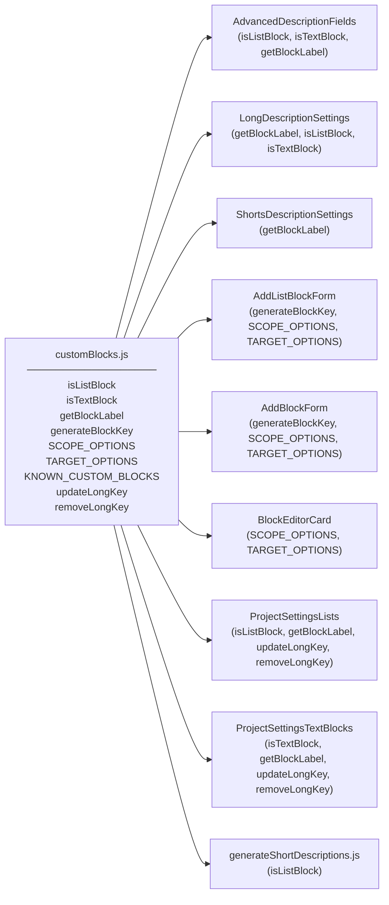
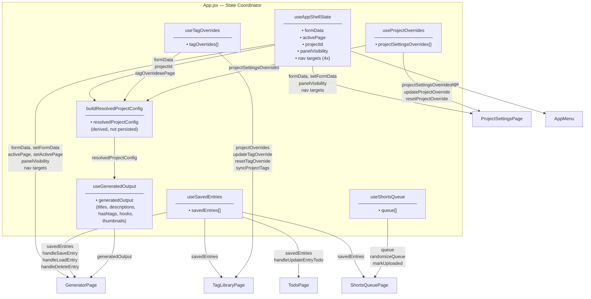
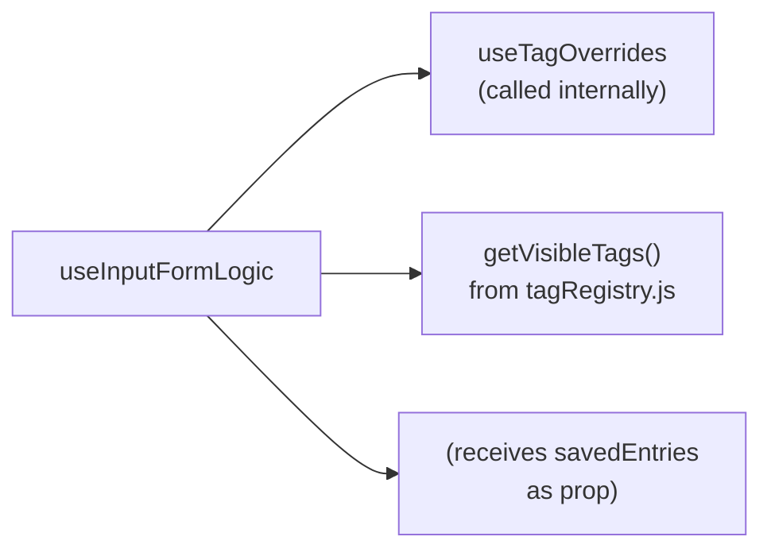
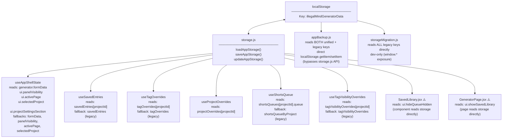
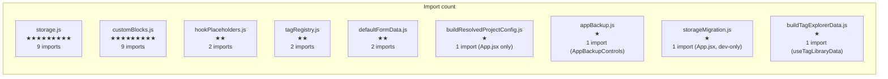
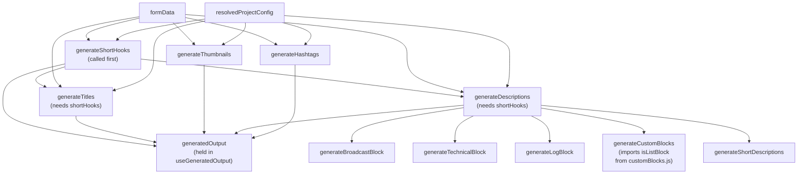
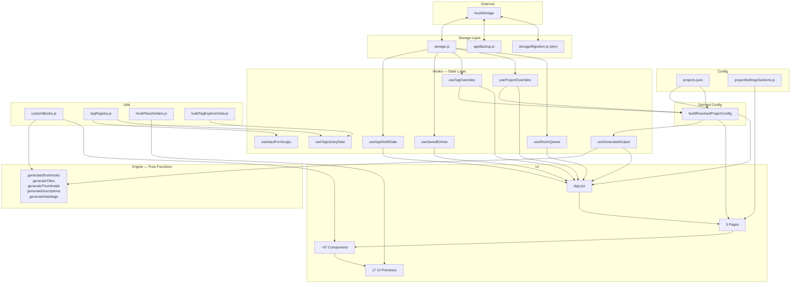

# Illegal Mind Generator — Graph Report

Component dependency graph, state ownership, storage access paths, and architectural analysis.

---

## Table of Contents

1. [Page → Component Relationships](#page--component-relationships)
2. [Component Dependency Graph](#component-dependency-graph)
3. [State Ownership](#state-ownership)
4. [Storage Access Paths](#storage-access-paths)
5. [Shared Utilities — Import Frequency](#shared-utilities--import-frequency)
6. [Generation Engine Dependencies](#generation-engine-dependencies)
7. [Most Central Files](#most-central-files)
8. [Architectural Bottlenecks](#architectural-bottlenecks)
9. [Duplicate Responsibilities](#duplicate-responsibilities)

---

## Page → Component Relationships

```mermaid
graph TD
    App["App.jsx\n──────────\ncalls 6 hooks\nroutes 5 pages"]

    App --> GP["GeneratorPage"]
    App --> TLP["TagLibraryPage"]
    App --> SQP["ShortsQueuePage"]
    App --> TP["TodoPage"]
    App --> PSP["ProjectSettingsPage"]

    GP --> IF["InputForm"]
    GP --> GRP["GeneratorResultsPanel"]
    GP --> SL["SavedLibrary"]

    IF --> BSF["BasicSongFields"]
    IF --> TTS["TransformationTagSelector"]
    IF --> ADF["AdvancedDescriptionFields"]
    IF --> IFA["InputFormActions"]
    IF --> QS["QueueSettings"]
    IF --> TDF["TodoFields"]
    IF --> ES["EntrySettings"]

    GRP --> TP2["TitlesPanel"]
    GRP --> DP["DescriptionsPanel"]
    GRP --> HP["HashtagsPanel"]
    GRP --> YTP["YouTubeTagsPanel"]

    TP2 --> GTPair["GeneratedTitlePair"]
    TP2 --> SHT["ShortHookTitles"]

    SL --> SLI["SavedLibraryItem"]

    TLP --> TC["TagCard ×N"]
    TLP --> TCont["TagControls"]

    TC --> TH["TagHeader"]
    TC --> TD["TagDetails"]
    TC --> TE["TagEditor"]
    TE --> TET["TagEditorTabs"]
    TET --> TTB["TagTitlesTab"]
    TET --> TDB["TagDescriptionsTab"]
    TET --> THB["TagHashtagsTab"]
    TET --> TSHB["TagShortHooksTab"]
    TET --> TBB["TagBasicsTab"]

    SQP --> SQI["ShortsQueueItem ×20"]
    SQP --> SQES["ShortsQueueEmptyState"]

    TP --> TSS["TodoStatusSection ×N"]
    TP --> TBA["TodoBulkAdd"]
    TSS --> TI["TodoItem ×N"]

    PSP --> PSC["ProjectSettingsContent"]
    PSC --> PSG["ProjectSettingsGeneral"]
    PSC --> PSSH["ProjectSettingsShortHooks"]
    PSC --> PST["ProjectSettingsTitles"]
    PSC --> PSBL["ProjectSettingsBlocks"]
    PSC --> PSLN["ProjectSettingsLinks"]
    PSC --> PSD["ProjectSettingsDescriptions"]

    PSBL --> PSLI["ProjectSettingsLists"]
    PSBL --> PSTB["ProjectSettingsTextBlocks"]
    PSBL --> PSHB["ProjectSettingsHookBlocks"]

    PSD --> LDS["LongDescriptionSettings"]
    PSD --> SDS["ShortsDescriptionSettings"]
```



**App.jsx is the sole routing layer.** There is no router library — `activePage` is a string toggled by `AppMenu`, and App.jsx conditionally renders the active page component.

---

## Component Dependency Graph

### UI Primitives — who uses what

The 17 UI primitives in `components/ui/` are consumed across the entire component tree.

```mermaid
graph LR
    subgraph "UI Primitives"
        IB["IconButton"]
        PF["PlaceholderField"]
        PR["PhraseRow"]
        HTE["HookTemplateEditor"]
        TGC["TemplateGroupCard"]
        BIC["BlockInfoCard"]
        SHC["ShortHookCard"]
        MC["MoveControls"]
        NLB["NavLinkButton"]
        FS["FormSelect"]
        STN["SubTabNav"]
        LIR["LabelInputRow"]
        LSR["LabelSliderRow"]
        ABR["AddBulkRow"]
        TIR["ToggleInputRow"]
        BT["BulkTextarea"]
    end

    PF --> PR
    PR --> HTE
    ABR --> HTE
    BT --> HTE
    HTE --> TGC
    LSR --> TGC
    IB --> TGC
    IB --> MC
    IB --> BIC
    TGC --> SHC

    HTE --> TagTitlesTab
    HTE --> TagDescriptionsTab
    HTE --> TagShortHooksTab
    HTE --> ProjectSettingsShortHooks
    HTE --> ProjectSettingsHookBlocks

    TGC --> ProjectSettingsShortHooks
    TGC --> ProjectSettingsHookBlocks

    BIC --> LongDescriptionSettings
    BIC --> ShortsDescriptionSettings

    NLB --> GeneratedTitlePair

    FS --> BlockEditorCard
    STN --> TagEditorTabs
    STN --> ProjectSettingsDescriptions
    STN --> ProjectSettingsBlocks

    TIR --> TitlePrefixSuffixSection
    TIR --> ProjectSettingsTitles

    PF --> AdvancedDescriptionFields
    PF --> TextBlockEditor
```



### customBlocks.js consumers

`customBlocks.js` is the most widely imported utility. It is consumed by both the engine layer and the UI layer.



---

## State Ownership

All state is owned by custom hooks called in `App.jsx`. Nothing uses React Context or a global store.



### Hook dependency on each other

`useInputFormLogic` (called in `InputForm.jsx`, not in `App.jsx`) is the only hook that calls another hook internally:



### State that flows furthest

| State | Owner | Reaches |
|-------|-------|---------|
| `formData` | `useAppShellState` | Generator input → generation engine → all output panels |
| `resolvedProjectConfig` | `buildResolvedProjectConfig` (memo in App) | All 5 generation engines + all settings editors |
| `savedEntries` | `useSavedEntries` | GeneratorPage, TodoPage, ShortsQueuePage, TagLibraryPage |
| `tagOverrides` | `useTagOverrides` | buildResolvedProjectConfig → generation + TagLibraryPage |
| `projectSettingsOverrides` | `useProjectOverrides` | buildResolvedProjectConfig → generation + ProjectSettingsPage |

---

## Storage Access Paths



### Storage field access matrix

| Field path | Writer | Readers |
|------------|--------|---------|
| `generator.formData` | `useAppShellState` | `useAppShellState` (init), engine via `resolvedProjectConfig` |
| `savedEntries[projectId]` | `useSavedEntries` | `useSavedEntries` (init) |
| `tagOverrides[projectId]` | `useTagOverrides` | `useTagOverrides` (init), `buildResolvedProjectConfig` |
| `projectOverrides[projectId]` | `useProjectOverrides` | `useProjectOverrides` (init), `buildResolvedProjectConfig` |
| `shortsQueues[projectId]` | `useShortsQueue` | `useShortsQueue` (init) |
| `tagVisibilityOverrides` | `useTagVisibilityOverrides` | (currently unused; kept for compatibility) |
| `ui.activePage` | `useAppShellState` | `useAppShellState` (init) |
| `ui.selectedProject` | `useAppShellState` | `useAppShellState` (init) |
| `ui.panelVisibility` | `useAppShellState` | `useAppShellState` (init) |
| `ui.hideQueueHidden` | `SavedLibrary.jsx` ⚠️ | `SavedLibrary.jsx` ⚠️ |
| `ui.showSavedLibrary` | `GeneratorPage.jsx` ⚠️ | `GeneratorPage.jsx` ⚠️ |
| `ui.projectSettingsSection` | `useAppShellState` | `useAppShellState` (init) |

⚠️ = component reads/writes storage directly, bypassing the hook layer

---

## Shared Utilities — Import Frequency



### storage.js consumers

```
useAppShellState.js
useSavedEntries.js
useTagOverrides.js
useProjectOverrides.js
useShortsQueue.js
useTagVisibilityOverrides.js
SavedLibrary.jsx       ← component (should be in a hook)
GeneratorPage.jsx      ← page (should be in a hook)
appBackup.js           ← util (acceptable; backup needs raw access)
```

### customBlocks.js consumers

```
AdvancedDescriptionFields.jsx   ← input form
LongDescriptionSettings.jsx     ← settings
ShortsDescriptionSettings.jsx   ← settings
AddBlockForm.jsx                ← settings/blocks
AddListBlockForm.jsx            ← settings/blocks
BlockEditorCard.jsx             ← settings/blocks
ProjectSettingsLists.jsx        ← settings/blocks
ProjectSettingsTextBlocks.jsx   ← settings/blocks
generateShortDescriptions.js    ← engine  ← cross-layer
```

`customBlocks.js` is the only file imported by both the UI layer and the engine layer. This is intentional (shared block-type definitions), but means changes to its API affect both layers simultaneously.

### hookPlaceholders.js consumers

```
HookTemplateEditor.jsx    ← ui primitive
TagShortHooksTab.jsx      ← tag editor
```

Both render editable phrase lists that support `{placeholder}` autocomplete. The same constant feeds both.

---

## Generation Engine Dependencies



All engine functions are called from `useGeneratedOutput.js` inside a single `useMemo`. They run synchronously on every `formData` or `resolvedProjectConfig` change. The `seed` value in the memo deps array is the only way to force re-randomization without changing inputs.

**Engine call order matters:** `generateShortHooks` must run first because both `generateTitles` and `generateDescriptions` take its output as an argument.

---

## Most Central Files

Ranked by structural centrality (how many other things depend on them, or how much of the app breaks if they change):

| Rank | File | Why it's central |
|------|------|-----------------|
| 1 | `src/utils/storage.js` | 9 imports; entire persistence layer |
| 2 | `src/utils/customBlocks.js` | 9 imports; shared by both UI and engine |
| 3 | `src/App.jsx` | Calls all hooks, routes all pages, computes resolvedProjectConfig |
| 4 | `src/hooks/useAppShellState.js` | Owns formData, activePage, projectId, panelVisibility, all nav targets |
| 5 | `src/utils/buildResolvedProjectConfig.js` | 1 import but runs on every render; single merge point for all config |
| 6 | `src/config/projects.json` | Base config for all generation; changing its schema touches engine + settings + tags |
| 7 | `src/hooks/useGeneratedOutput.js` | Calls all 5 engines; owns the entire output object |
| 8 | `src/hooks/useSavedEntries.js` | Entry data flows to 4 pages; backup/import logic lives here |
| 9 | `src/components/ui/HookTemplateEditor.jsx` | Used by Shorts Hooks, Hook Blocks, Tag Titles, Tag Hooks, Tag Descriptions |
| 10 | `src/components/ui/PlaceholderField.jsx` | Base input for all editable phrase fields |

### Blast radius map

If you change the signature or behavior of these files, here's what breaks:

| File changed | Immediate breakage | Cascading breakage |
|---|---|---|
| `storage.js` | All 6 hooks stop persisting | Entire app loses state |
| `customBlocks.js` | 8 UI components + 1 engine file | Description layout + block editors + generation output |
| `buildResolvedProjectConfig.js` | App.jsx computed config is wrong | All generation engines get wrong config |
| `projects.json` (schema change) | `buildResolvedProjectConfig` merge fails | All engines + all settings editors |
| `useAppShellState.js` | formData lost, navigation breaks | GeneratorPage, all output, ProjectSettingsPage |
| `useSavedEntries.js` | Library CRUD breaks | SavedLibrary, TodoPage, ShortsQueuePage, TagLibraryPage |
| `HookTemplateEditor.jsx` | All phrase array editors | Shorts Hooks, Hook Blocks, Tag Titles/Hooks/Descriptions |

---

## Architectural Bottlenecks

### 1. App.jsx is the single coordination point for all state

```
App.jsx calls:
  useAppShellState()       → formData, activePage, projectId, panelVisibility, 4 nav targets
  useGeneratedOutput()     → all engine output
  useSavedEntries()        → all entry CRUD
  useTagOverrides()        → all tag overrides
  useProjectOverrides()    → all settings overrides
  useShortsQueue()         → queue (even when not on Shorts page)
  buildResolvedProjectConfig() → resolved config (runs every render)
```

All state is props-drilled down from App.jsx. There is no lazy initialization — `useShortsQueue`, for example, initializes and persists even when the user is on the Generator page and the queue is not visible.

**Effect:** App.jsx re-renders whenever any hook's state changes, triggering `buildResolvedProjectConfig` and `useGeneratedOutput`'s memo recompute on every keystroke in the form.

---

### 2. useAppShellState is a megahook

It owns five conceptually distinct pieces of state:

```
1. Generator form:     formData, setFormData
2. UI navigation:      activePage, setActivePage
3. Project selection:  projectId, handleProjectChange
4. Panel state:        panelVisibility, setPanelVisibility, togglePanel
5. Nav targets (4x):   tagLibrarySearchTarget, shortHooksTarget,
                       titlesTarget, blocksTarget
                       (and their open/clear callbacks)
```

The nav targets exist to support "jump from output to settings editor" flows. They are set/cleared frequently and trigger re-renders of everything that reads from this hook — which is App.jsx, which re-renders the active page.

---

### 3. buildResolvedProjectConfig runs on every render

```js
// App.jsx
const resolvedProjectConfig = useMemo(
  () => buildResolvedProjectConfig(projectConfig, tagOverrides, projectSettingsOverrides),
  [projectConfig, tagOverrides, projectSettingsOverrides]
);
```

`tagOverrides` and `projectSettingsOverrides` are objects that re-reference on every hook call, so `useMemo` may miss dependency stability opportunities. `buildResolvedProjectConfig` does a `structuredClone` internally, which is not free.

---

### 4. Generation runs synchronously on every formData keystroke

```js
// useGeneratedOutput.js
const generatedOutput = useMemo(
  () => ({
    shortHooks: generateShortHooks(formData, resolvedProjectConfig),
    titles:     generateTitles(formData, resolvedProjectConfig, shortHooks),
    thumbnails: generateThumbnails(formData, resolvedProjectConfig),
    ...generateDescriptions(formData, resolvedProjectConfig, shortHooks),
    ...generateHashtags(formData, resolvedProjectConfig),
  }),
  [formData, resolvedProjectConfig, seed]
);
```

No debounce. Every keystroke in the Artist or Song field triggers a full generation cycle across all 5 engines. Currently fast because templates are small, but worth noting if template sets grow significantly.

---

### 5. Two components access storage directly (bypassing the hook layer)

`SavedLibrary.jsx` reads and writes `ui.hideQueueHidden` directly via `updateAppStorage`. `GeneratorPage.jsx` reads and writes `ui.showSavedLibrary` directly. Both bypass the hook layer, making these two UI state values invisible to `useAppShellState`.

```
Expected pattern:         Actual pattern for these two fields:
  useAppShellState          SavedLibrary.jsx
       ↓                    GeneratorPage.jsx
  storage.js                     ↓
  localStorage               storage.js
                             localStorage
```

---

### 6. useTagVisibilityOverrides exists but is not directly consumed

A standalone `useTagVisibilityOverrides` hook exists with full CRUD (get, set, toggle visibility per tag). However, tag visibility is computed inside `buildTagExplorerData.js` → `useTagLibraryData`, not via this hook's returned API. The hook writes to `tagVisibilityOverrides` in storage, but the reading path goes through `tagOverrides` (where `visible` is stored as a tag override field).

This means the hook may be writing to a storage field that nothing reads back through the hook's own interface.

---

## Duplicate Responsibilities

### 1. Entry CTA text has two storage paths

```
Legacy path:   entry.customCta (string)
New path:      entry.songBlockOverrides.customCtaBlock (string)

On load:  handleLoadEntry() seeds customCtaBlock from customCta if not already set
On save:  handleSaveEntry() writes both (customCta preserved, songBlockOverrides written)
On form:  AdvancedDescriptionFields renders the customCtaBlock override field
Engine:   getEffectiveSongOverrides() reads both, songBlockOverrides wins
```

The dual path is intentional for backward compatibility, but any code touching CTA text must be aware of both fields. The migration completes naturally when an entry is next saved.

---

### 2. Tag visibility is stored twice

```
Path A:  tagOverrides[projectId][tagName].visible (boolean)
         Set by: updateTagOverride() in useTagOverrides
         Read by: buildResolvedProjectConfig → resolvedProjectConfig.tags[name].visible

Path B:  tagVisibilityOverrides[projectId][tagName] (boolean)
         Set by: useTagVisibilityOverrides.setTagVisibility()
         Read by: (unclear — buildTagExplorerData reads tagOverrides, not this field)
```

Path A is the active path. Path B (the dedicated `tagVisibilityOverrides` field) appears to be a legacy structure from before tag overrides were unified. The standalone hook for it may be writing to a field nothing reads. The field is kept in the storage schema for data-shape compatibility.

---

### 3. Entry story/log note fields have three representations

For `storyBlock` and `logBlock`:

```
Old field:   entry.customStory / entry.customLogNote (string on entry object)
Seed field:  formData.songBlockOverrides.storyBlock / logBlock (seeded from above on load)
New field:   entry.songBlockOverrides.storyBlock / logBlock (written on save)

Engine reads: getEffectiveSongOverrides(formData) → checks songBlockOverrides first,
              then falls back to legacy fields (formData.customStory, formData.customLogNote)
```

Same pattern as CTA — intentional migration path, but creates three potential sources of truth for the same data during the transition window.

---

### 4. storageMigration.js is dead code in production

```js
// App.jsx
import {
  previewUnifiedStorageMigration,
  writeUnifiedStorageMigration,
} from './utils/storageMigration';

// ... exposed to window for dev use
window.previewUnifiedStorageMigration = previewUnifiedStorageMigration;
window.writeUnifiedStorageMigration = writeUnifiedStorageMigration;
```

`storageMigration.js` is still imported in `App.jsx` and its functions are leaked to `window`. It is not called automatically — it requires manual invocation from the browser console. It's dev scaffolding that was never removed after the migration was completed. The import adds to the bundle and the `window.*` assignments could be surprising to new developers.

---

### 5. Two separate "short hooks" systems that share the same config keys

```
System A:  generateShortHooks.js
           → produces hook-based Shorts titles
           → reads: config.title.shortsPrefix / shortsSuffix (fallback: shortHookSuffix)
           → output: [{label, hooks: [{text, sourceType, ...}]}]

System B:  generateTitles.js (Shorts mode)
           → produces transformation-based Shorts titles
           → reads same config keys (shortsPrefix, shortsSuffix, shortHookSuffix)

Both are displayed in TitlesPanel. Both are editable from Project Settings → Titles.
```

These are intentionally separate but share config keys and display space. A developer editing the Shorts prefix in Project Settings changes both systems simultaneously, which may not be obvious.

---

## Summary — Dependency Topology



**The topology has three clear tiers:**

1. **Storage → Hooks** — storage.js feeds all stateful hooks
2. **Hooks + Config → App** — all hooks report to App.jsx; config is resolved there
3. **App → Pages → Components** — state props-drills down through pages to leaf components

The engine layer is cleanly isolated (pure functions, no imports from UI or hooks). The utility layer (`customBlocks.js`, `tagRegistry.js`) bridges the engine and UI sides. The main tension points are `App.jsx` (too much coordination) and `useAppShellState` (too much state in one hook).
